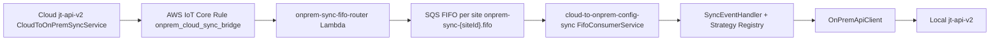
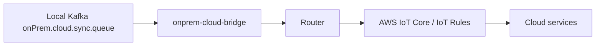

# DeJoule On-Premise

Knowledge base for the on-premise and hybrid cloud/on-prem infrastructure in `/Users/atif-salafi/Desktop/workspace/office-space`.

Use this skill to orient before editing on-prem sync, bridge, migration, or deployment code. The main theme is **ordered, reliable, observable sync between cloud and on-prem systems**, with careful deletion/commit semantics so messages are never lost silently.

---

## Repo Map

| Repo / folder | Role |
|---|---|
| `onprem-sync-fifo-router` | Cloud Lambda invoked by AWS IoT Rule; validates sync event and routes it to per-site SQS FIFO queue. |
| `cloud-to-onprem-config-sync` | On-prem service; polls the site FIFO queue and applies events to local `jt-api-v2` through HTTP. Current branch replaces Kafka hot path with direct FIFO polling. |
| `on-prem-infrastructure/onprem-cloud-bridge` | On-prem to cloud bridge; consumes local Kafka topic and publishes feedback/requests to AWS IoT Core. |
| `on-prem-infrastructure/msk-iot-event-orchestrator` | Cloud-side MSK to IoT bridge; consumes command/mode/recipe/health topics, writes audit events, and publishes authoritative state to IoT Core. |
| `on-prem-infrastructure/iot-mqtt-bridge` | Go MQTT to Kafka bridge; subscribes to AWS/local MQTT topics and publishes normalized envelopes to Kafka. |
| `on-prem-infrastructure/site-onboarding-migration` | Genesis migration CLI; migrates site data from cloud stores to on-prem databases with preflight, state, verify, and blue/green flow. |

Do not use `node_modules`, `dist`, `.env`, cert folders, or generated reports as source of truth unless explicitly debugging build/runtime artifacts.

---

## Current Cloud To On-Prem Config Flow

Current intended hot path:



Key design choices:

- Per-site FIFO queue, not one shared queue.
- `MessageGroupId = site_id`.
- `MessageDeduplicationId = transaction_id`.
- One on-prem message at a time: `MaxNumberOfMessages = 1`.
- Process-one-delete-one: delete from SQS only after local API success.
- On failure, leave the message in queue; visibility timeout handles retry.
- Queue URL resolution is cached by site id.
- Unknown event names should not crash the consumer if no endpoint mapping exists; log and skip.

---

## onprem-sync-fifo-router

Repository: `/Users/atif-salafi/Desktop/workspace/office-space/onprem-sync-fifo-router`

Purpose:

- Lambda entry point for AWS IoT Rule events.
- Parse raw IoT event.
- Reject malformed JSON, invalid events, and payloads over 256KB.
- Validate with Zod.
- Ensure a per-site FIFO queue exists.
- Route event to SQS FIFO.
- Emit CloudWatch metrics.

Important files:

| File | Meaning |
|---|---|
| `src/handler.ts` | Lambda entry point and validation/routing orchestration |
| `src/router.ts` | SQS send with retry/backoff and message attributes |
| `src/queue-manager.ts` | Queue auto-create + URL resolution |
| `src/queue-name.ts` | Queue naming convention |
| `src/validator.ts` | Sync event schema |
| `src/metrics.ts` | CloudWatch metrics |
| `serverless.yml` | Lambda/IAM/IoT Rule deployment |
| `docs/deployment-runbook.md` | Deployment/rollback guidance |

Queue convention:

| Queue | Pattern |
|---|---|
| Main FIFO | `onprem-sync-{siteId}.fifo` |
| DLQ | `onprem-sync-{siteId}-dlq.fifo` |

Router rules:

- Retry only transient SQS errors: throttling, service unavailable, request timeout, HTTP 429/5xx.
- Throw after retry exhaustion so IoT Rule error action can log.
- Discard invalid/malformed/oversized events with a failure metric; do not poison downstream queues.

Commands:

```bash
npm test
npx tsc --noEmit
npx serverless deploy --stage dev
npx serverless deploy --stage prod
```

---

## cloud-to-onprem-config-sync

Repository: `/Users/atif-salafi/Desktop/workspace/office-space/cloud-to-onprem-config-sync`

Purpose:

- Runs on the on-prem server.
- Polls the site-specific SQS FIFO queue.
- Validates sync events.
- Calls local `jt-api-v2` endpoints.
- Deletes message only after successful local application.

Current branch note:

- `feature/fifo-consumer` replaces the previous Kafka hot path with direct SQS FIFO polling.
- Some README/package wording may still mention Kafka; check `src/index.ts`, `FifoConsumerService`, and `CLAUDE.md` for current behavior.

Important files:

| File | Meaning |
|---|---|
| `src/index.ts` | Main FIFO consumer bootstrap |
| `src/server.ts` | `/health`, `/ready`, `/metrics` endpoints |
| `src/services/sqs/FifoConsumerService.ts` | Sequential SQS polling, process-one-delete-one |
| `src/services/sqs/QueueUrlResolver.ts` | Queue name/URL cache |
| `src/handlers/SyncEventHandler.ts` | Message decode, validation, strategy dispatch |
| `src/handlers/strategies/index.ts` | Strategy registry, generic local API strategy |
| `src/constants/apiEndpoints.ts` | Event name to local API endpoint source of truth |
| `src/services/api/OnPremApiClient.ts` | Local API request builder/auth/caller |
| `src/services/api/ServiceTokenProvider.ts` | Redis/API-backed service token fetch/cache |
| `src/services/validation/syncEvent.schema.ts` | Zod schema |
| `src/config/appConfig.ts` | Env-based config |

Consumer rules:

- `maxNumberOfMessages` must stay `1` for strict per-site ordering.
- Use long polling (`WaitTimeSeconds` around 20).
- If processing succeeds, delete the SQS message.
- If processing fails, do not delete; let visibility timeout retry.
- Empty/no-body messages may be deleted to prevent queue blockage.
- Graceful shutdown should stop polling and finish current cycle.

API client rules:

- Event payload becomes local API payload: `siteId`, `userId`, `transactionId`, payload fields, and optional `deviceId`.
- Resolve `:siteId`, `:deviceId`, etc. from event fields and payload.
- Use service tokens from Redis first, then `/m2/auth/v2/issue-service-token`.
- `user.create` and `user.delete` may require service-account auth because the target user may not exist on-prem.
- Include headers: `X-Transaction-ID`, `X-Current-Time`, `Authorization`.
- Capture local API failures with Sentry context: event name, site id, transaction id, endpoint, method.

Security note:

- Remove the debug `console.log(appConfig.onPremApi, process.env.ONPREM_API_SERVICE_SECRET)` pattern if touched; never log service secrets.
- Use env vars/IAM roles. Do not commit `.env`, certs, or secrets.

Commands:

```bash
npm test
npm run build
npm start
curl http://localhost:7001/health
curl http://localhost:7001/ready
```

---

## Supported Config Sync Events

`cloud-to-onprem-config-sync/src/constants/apiEndpoints.ts` is the source of truth.

Major families:

- `device.*`
- `controller.*`
- `component.*`
- `recipe.*`
- `superrecipe.*` and `super-recipe.*`
- `smart-alert.*`
- `site.*`
- `user.*`
- `configurator.*`
- `configurator-page.*`
- `configurator-table.*`
- `configurator-graph.*`
- `systems.*`
- `system-nodes.*`
- `site-system-mapping.*`
- `nodes.*`
- `driver.*`
- `control.*`

When adding an event:

1. Add endpoint mapping.
2. Confirm local `jt-api-v2` endpoint exists on-prem.
3. Confirm path params can resolve from event fields/payload.
4. Add validation/test coverage.
5. Confirm idempotency or safe retry behavior.
6. Confirm auth user/service account behavior.

---

## On-Prem To Cloud Flow

Repository: `/Users/atif-salafi/Desktop/workspace/office-space/on-prem-infrastructure/onprem-cloud-bridge`

Purpose:

- Consume local Kafka topic `onPrem.cloud.sync.queue`.
- Publish to AWS IoT Core over mTLS.
- Route recipe/mode/command feedback to specific IoT Rule topics.
- Preserve at-least-once semantics with manual offset commits.
- Pause consumption when AWS IoT is unreachable.

High-level flow:



Rules:

- Commit Kafka offsets only after confirmed publish.
- Retry transient publish failures with bounded exponential backoff.
- Requeue delivery timeouts where the service is designed to retry.
- DLQ unrecoverable messages.
- Log structured JSON and expose health/Prometheus metrics.
- Certificates are mounted/read from environment paths; never commit or print cert/private key material.

---

## Cloud MSK To IoT Flow

Repository: `/Users/atif-salafi/Desktop/workspace/office-space/on-prem-infrastructure/msk-iot-event-orchestrator`

Purpose:

- Consume AWS MSK topics:
  - `dejoule.command.onprem.sync`
  - `dejoule.mode.onprem.sync`
  - `dejoule.recipe.onprem.sync`
  - `dejoule.health.onprem.sync`
- Process command, mode, recipe, and health packets.
- Emit audit event for every packet.
- Publish state/commands to AWS IoT Core.

Important behavior:

- Uses `eachBatchAutoResolve: false`.
- Resolve offsets only after successful handler processing.
- Throw on error so message retries on restart/rebalance.
- Recipe topic deduplicates within a batch by `rid`, keeping highest `packetTs`.
- Command and mode topics process every message in order.
- Shared dependencies are injected into handlers: IoT publisher, audit producer, Dynamo/Postgres/Influx clients.

Kafka connection should follow `engineering-standards`: heartbeat, manual offset semantics, lag awareness, retry, graceful shutdown, and DLQ/audit where applicable.

---

## MQTT To Kafka Bridge

Repository: `/Users/atif-salafi/Desktop/workspace/office-space/on-prem-infrastructure/iot-mqtt-bridge`

Purpose:

- Go service that subscribes to AWS IoT Core or local MQTT broker.
- Routes MQTT topic patterns to Kafka topics.
- Wraps messages in a normalized envelope.

Default mappings:

| MQTT filter | Kafka topic |
|---|---|
| `+/feedback/+/recipelogicconfig` | `iotcore.feedback.recipe` |
| `+/feedback/+/recipeControl` | `iotcore.feedback.recipe` |
| `+/request/+/recipesync` | `iotcore.feedback.recipe` |
| `+/feedback/+/mode` | `IoTFeedback.ModeChange` |

Build/test:

```bash
make build
make test
go test ./...
```

Rules:

- Support AWS IoT mTLS and local broker mode.
- Keep topic matching configurable/extensible.
- Do not put business logic in the bridge; route/envelope/publish only.

---

## Site Onboarding Migration

Repository: `/Users/atif-salafi/Desktop/workspace/office-space/on-prem-infrastructure/site-onboarding-migration`

Purpose:

- CLI for Genesis/on-prem site onboarding data migration.
- Migrates site data from DynamoDB/PostgreSQL to MongoDB/PostgreSQL targets.
- Supports preflight, migration, verification, state/resume, reporting, blue/green, rollback.

Commands:

```bash
npm run preflight:dynamodb -- <siteId>
npm run migrate:dynamodb -- <siteId>
npm run verify:dynamodb -- <siteId>
npm run migrate:vigilante -- <siteId>
npm run verify:vigilante -- <siteId>
npm run migrate:dejoule -- <siteId>
npm run verify:dejoule -- <siteId>
```

Rules:

- Always run preflight before migrate.
- Use dry-run or read-only inspection first when available.
- Keep state files and reports out of source unless explicitly intended.
- Verify counts, checksums/shape, indexes, and critical table/collection presence.
- For production migrations, document rollback and blue/green cutover.

---

## Design Rules For On-Prem Work

- Preserve ordering per site.
- Prefer per-site isolation over global shared queues.
- Use idempotent local APIs; retries are expected.
- Never delete/commit/ack a message before downstream success.
- Bound retries and visibility timeouts.
- Emit structured logs with `site_id`, `event_name`, `transaction_id`, `messageId`, outcome, and duration.
- Emit metrics for routed, failed, retried, DLQ, processing latency, and queue depth.
- Treat unknown/invalid input differently from transient downstream failures.
- Never log secrets, tokens, certs, private keys, raw credentials, or sensitive payload values.
- Use centralized endpoint mappings and validators; do not scatter event-to-URL logic.
- Keep bridges thin: route, validate, publish, acknowledge. Business logic belongs in handlers/services or jt-api-v2.

---

## Debugging Playbook

### Cloud change did not reach on-prem

1. Check cloud `jt-api-v2` emitted a sync event with `transaction_id`, `site_id`, and `event_name`.
2. Check AWS IoT Rule `onprem_cloud_sync_bridge` invoked Lambda.
3. Check `onprem-sync-fifo-router` logs and `SyncEventRouted` / `SyncEventRoutingFailed`.
4. Check queue name `onprem-sync-{siteId}.fifo`.
5. Check SQS visible/in-flight counts and DLQ.
6. Check on-prem consumer `/health` and `/ready`.
7. Check consumer logs for validation/API errors.
8. Check local `jt-api-v2` endpoint response and auth token issuance.

### Message stuck/retrying

- Confirm local API idempotency.
- Inspect error status/body in `OnPremApiClient` logs.
- Confirm service token can be issued for event user or service account.
- Confirm event endpoint mapping path params resolve.
- Check visibility timeout and max receive count.
- Check whether failure is permanent validation/config or transient API/network.

### On-prem feedback not reaching cloud

1. Check local Kafka topic has messages.
2. Check onprem-cloud-bridge Kafka consumer lag.
3. Check AWS IoT mTLS cert paths and connectivity.
4. Check IoT Rule topic selection for recipe/mode/command.
5. Check manual offset commit only happens after publish.
6. Check DLQ and Prometheus metrics.

---

## PR / Review Checklist

- [ ] Current hot path verified from source, not stale README.
- [ ] Ordering semantics preserved.
- [ ] Message delete/offset commit happens only after success.
- [ ] Retry path is bounded and observable.
- [ ] Invalid input does not poison ordered queues.
- [ ] Endpoint mapping and schema updated together.
- [ ] Service token/auth fallback tested if user events are touched.
- [ ] No secrets/certs/env files included or logged.
- [ ] Health/readiness/metrics considered.
- [ ] Tests run for touched repo (`npm test`, `vitest`, `jest`, `go test`, or `tsc --noEmit` as applicable).
